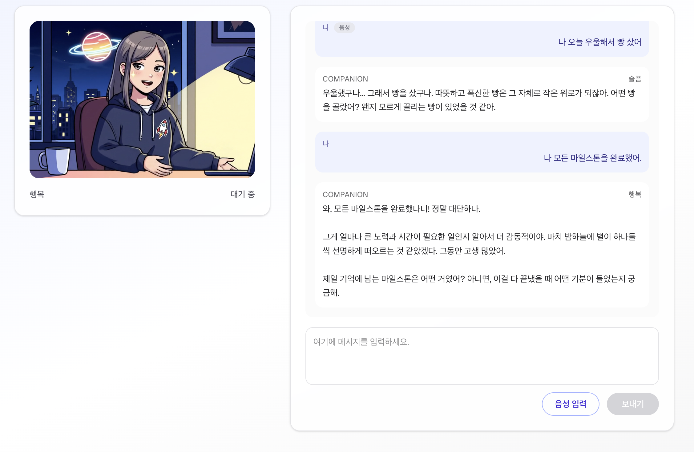

# Grok AI Companion PoC (Web · Veo2 · Gemini · FastAPI)

> Veo2로 생성한 AI 캐릭터 영상을 기반으로  
> 텍스트/음성 대화를 지원하는 **웹 PoC** 프로젝트입니다.  
> 프론트는 **Next.js(React)**, 백엔드는 **FastAPI**를 사용합니다.

---



## ✨ 프로젝트 목표

마일스톤 계획:

1. **PoC 기획 및 페르소나 정의** ✅  
2. **Veo2 에셋 3종(기본/기쁨/슬픔 × idle) 제작** ✅  
3. **웹 UI + Gemini 연동을 통해, 유저 입력에 따라 캐릭터 감정/상태가 바뀌는 대화 데모 구현**  ✅  
4. **STT/TTS를 활용한 음성 대화 기능 확장**  ✅  

---

## 🧠 기능 개요

- **AI 캐릭터 페르소나**
  - 23세, 야간 감성, 카툰풍 애니 스타일 캐릭터
  - 3가지 감정 상태 + 각 상태별 대기 영상
- **감정 상태(Emotion)**
  - `base` : 기본 상태 (경청/분석)
  - `happy`: 기쁜 상태 (영감/동의)
  - `sad`  : 슬픈 상태 (정체/공감)
- **모드(Mode)**
  - `idle`    : 대기 상태 (말하지 않음, idle loop)

**조합 예시**

| 상태              | Emotion | Mode     | 설명                             |
|-------------------|---------|----------|----------------------------------|
| 기본 대기         | base    | idle     | 분석/경청, idle 루프             |
| 기쁜 대기         | happy   | idle     | 영감/동의, 고개 끄덕이는 idle   |
| 슬픈 대기         | sad     | idle     | 막힌 상태, 조용히 공감하는 idle |

---

## 🏗️ 기술 스택

### Frontend

- **Next.js 14+ (App Router)**
- **React + TypeScript**
- **Tailwind CSS**
- 상태 관리: React 훅 + (선택) React Query
- 비디오: HTML `<video>` 태그 기반 루프 재생

### Backend

- **FastAPI (Python 3.11+)**
- HTTP 서버: `uvicorn`
- LLM: **Gemini API** (또는 호환 가능한 LLM API)
- (선택) STT/TTS: 별도 Provider 연동 (예: Google, OpenAI, etc.)

---

## 🗂️ 폴더 구조 제안

> 실제 구조는 필요에 따라 조정 가능

```bash
.
├── frontend/                  # Next.js (React) 앱
│   ├── app/
│   │   ├── layout.tsx
│   │   └── page.tsx          # 메인 Companion 화면
│   ├── public/
│   │   └── videos/           # Veo2 결과물 mp4 6개
│   └── src/
│       ├── components/
│       │   ├── VideoAvatar.tsx
│       │   ├── ChatPanel.tsx
│       │   ├── MessageBubble.tsx
│       │   ├── MicButton.tsx        # STT 버튼(선택)
│       │   └── AudioPlayer.tsx      # TTS 재생(선택)
│       ├── hooks/
│       │   └── useChat.ts
│       ├── lib/
│       │   ├── apiClient.ts
│       │   ├── emotionMapping.ts
│       │   └── types.ts
│       └── styles/
│           └── globals.css
└── backend/                   # FastAPI 서버
    └── app/
        ├── main.py
        ├── api/
        │   ├── chat.py       # /api/chat 엔드포인트
        │   ├── stt.py        # /api/stt (선택)
        │   └── tts.py        # /api/tts (선택)
        ├── core/
        │   ├── config.py
        │   ├── state_machine.py
        │   ├── gemini_client.py
        │   ├── tts_client.py
        │   └── stt_client.py
        └── models/
            └── chat.py

```

---

## 🧩 동작 흐름 (전체 플로우)

flowchart LR
  U[User<br/>텍스트/음성 입력] -->|텍스트 or STT| F[Frontend<br/>Next.js]
  F -->|POST /api/chat| B[Backend<br/>FastAPI]
  B -->|LLM 호출| G[Gemini API]
  G -->|텍스트 응답| B
  B -->|감정/상태 결정<br/>(state_machine)| B
  B -->|JSON 응답<br/>{reply, emotion, mode, tts_url}| F
  F -->|emotion, mode| V[VideoAvatar<br/>Veo2 클립 선택]
  F -->|reply, tts_url| C[Chat UI / AudioPlayer]


## 🔌 API 규격
POST /api/chat
Request (JSON)

{
  "session_id": "optional-session-id",
  "user_message": "string",
  "current_emotion": "base",
  "current_mode": "idle"
}
current_emotion: "base" | "happy | "sad"

current_mode: "idle"

Response (JSON)

{
  "reply": "AI의 텍스트 응답",
  "emotion": "base",
  "mode": "idle",
  "tts_audio_url": null,
  "debug": {
    "state_reason": "감정/상태 결정 이유에 대한 간단한 설명"
  }
}
emotion / mode → 프론트에서 어떤 Veo2 영상을 재생할지 결정

tts_audio_url → 선택: TTS 기능 붙였을 때만 사용

## 🎬 영상 에셋 매핑 (Veo2)
frontend/public/videos/ 아래에 저장:

emotion	mode	파일명 예시
base	idle	base_idle.mp4
happy	idle	happy_idle.mp4
sad	idle	sad_idle.mp4

emotionMapping 예시

// frontend/src/lib/emotionMapping.ts
export type Emotion = 'base' | 'happy' | 'sad';
export type Mode = 'idle';

export const VIDEO_SOURCES: Record<Emotion, Record<Mode, string>> = {
  base: {
    idle: '/videos/base_idle.mp4',
  },
  happy: {
    idle: '/videos/happy_idle.mp4',
  },
  sad: {
    idle: '/videos/sad_idle.mp4',
  },
  
## ⚙️ 환경 변수
Frontend (frontend/.env.local)
bash
코드 복사
NEXT_PUBLIC_BACKEND_URL=http://localhost:8000
Backend (backend/.env 또는 시스템 환경변수)

GEMINI_API_KEY=your_gemini_api_key_here
TTS_API_KEY=your_tts_api_key_here          # 선택
STT_API_KEY=your_stt_api_key_here          # 선택
ALLOWED_ORIGINS=http://localhost:3000
## 🚀 로컬 실행 방법
1) Backend (FastAPI)
bash
코드 복사
cd backend

# 가상환경 생성 (선택)
python -m venv .venv
source .venv/bin/activate  # Windows: .venv\Scripts\activate

# 패키지 설치
pip install -r requirements.txt

# 서버 실행
uvicorn app.main:app --reload --host 0.0.0.0 --port 8000
기본 접속: http://localhost:8000

(선택) Swagger UI: http://localhost:8000/docs

2) Frontend (Next.js)
cd frontend

# 패키지 설치
npm install

# 개발 서버 실행
npm run dev
기본 접속: http://localhost:3000

## 🧮 상태 결정 로직 (간단 버전)
백엔드의 app/core/state_machine.py에서
유저 입력 + 모델 응답 텍스트를 보고 **감정(emotion)**을 간단하게 결정합니다.

예시:

def decide_state(user_message: str, model_reply: str, current_emotion: str):
    text = (user_message + " " + model_reply).lower()
    reason = ""

    happy_keywords = ["good", "great", "awesome", "재밌", "좋아", "ㅋㅋ", "행복"]
    sad_keywords = ["sad", "힘들", "우울", "막힌", "답답", "슬프", "불안"]

    emotion = "base"

    if any(k in text for k in happy_keywords):
        emotion = "happy"
        reason = "Detected happy-related keywords."
    elif any(k in text for k in sad_keywords):
        emotion = "sad"
        reason = "Detected sad-related keywords."
    else:
        emotion = "base"
        reason = "No strong emotional keywords found."

    # talking/idle 모드는 프론트에서 TTS 재생 여부로 관리
    mode = "idle"

    return emotion, mode, reason
프론트에서는:

유저 메시지 보냄 → /api/chat 호출

응답 수신:

emotion으로 영상 묶음 선택

TTS 재생 중일 때 mode = 'talking', 끝나면 다시 'idle'

## 🧭 향후 확장 아이디어
관계 메타/호감도 시스템:

Grok 스타일의 relationship meter를 상태 머신에 통합

더 세밀한 감정 분류:

단순 키워드 → 분류 모델/프롬프트 기반 감정 분석으로 고도화

멀티 캐릭터 지원:

Ani, Mika, Nova 등 캐릭터별로 다른 Veo2 에셋 + 프롬프트 세트

대화 로그/메모리:

세션 기반 스토리지로 사용자별 장기 기억 구현

## 📄 라이선스
추후 프로젝트 공개 범위에 맞게 라이선스를 선택하세요.
예: MIT, Apache-2.0, Proprietary 등

(예시)
This project is currently for internal PoC and demo purposes only.
Do not distribute without permission.
💡 개발 메모
이 리포지토리는 Cursor AI 기반 개발 워크플로를 염두에 두고 설계되었습니다.

프론트/백 구조와 API 스펙은 최소 PoC에 초점이 맞춰져 있으며,
실서비스 단계에서는 인증, 로깅, 에러 처리, Observability 등을 추가하는 것을 권장합니다.
